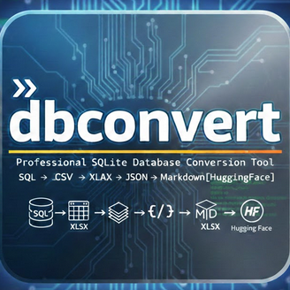
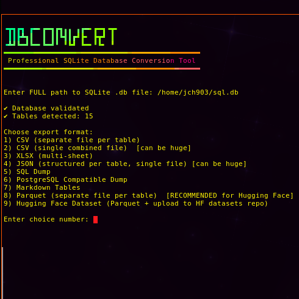
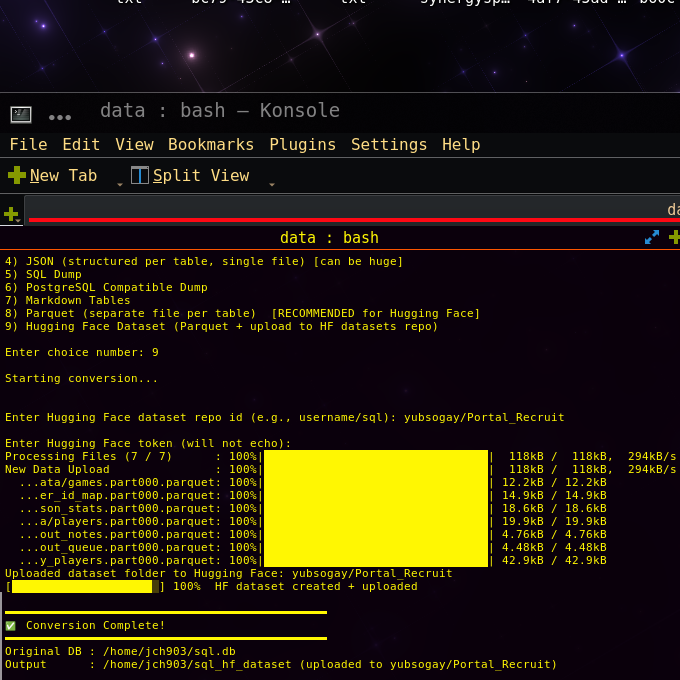

<p align="center">
  
</p>

# DBCONVERT  
Professional SQLite Database Conversion Tool

---

## Overview

`dbconvert` is a production-grade SQLite database conversion utility designed for:

- Structured multi-table exports  
- Large database handling (chunked export)  
- Machine learning pipelines  
- Hugging Face dataset publishing  
- Analytics workflows  

It supports multiple output formats, including Parquet and direct Hugging Face dataset upload.

---

## Screenshots

<p align="center">
  
</p>

<p align="center">
  
</p>

---

## Features

- SQLite integrity validation
- Automatic table detection
- Chunked export for large tables
- Parquet sharding (ML-ready)
- Hugging Face dataset upload
- Structured progress output
- Clean, production-ready Bash implementation

---

## Supported Export Formats

| Option | Format | Use Case |
|--------|--------|----------|
| 1 | CSV (per table) | Lightweight structured export |
| 2 | CSV (combined) | Flat archival (can be large) |
| 3 | XLSX | Excel multi-sheet export |
| 4 | JSON | Structured API-style export |
| 5 | SQL Dump | Full schema + data backup |
| 6 | PostgreSQL Dump | Migration starting point |
| 7 | Markdown Tables | Documentation export |
| 8 | Parquet (per table) | **Recommended for ML & HF** |
| 9 | Hugging Face Dataset | Parquet + automatic HF upload |

---

## System Requirements

- Debian / Ubuntu Linux (recommended)
- Python 3.9+
- SQLite3

---

## Installation

### 1️⃣ Clone the Repository

```bash
git clone https://github.com/jch903/dbconvert.git
cd dbconvert
2️⃣ Install Python Dependencies
pip install -r requirements.txt

Installs:

pandas

pyarrow

datasets

huggingface_hub

openpyxl

tqdm

tabulate

3️⃣ Install Required System Packages
sudo apt install sqlite3 pv figlet toilet lolcat
4️⃣ Install dbconvert Globally

Run the installation script:

chmod +x install.sh
./install.sh

This installs the command into:

/usr/local/bin/dbconvert

After installation, run:

dbconvert

from anywhere.

Usage
dbconvert

You will be prompted for:

Full path to your SQLite .db file

Export format selection

(If applicable) Hugging Face dataset repo + token

Hugging Face Workflow (Recommended)

For ML / analytics use cases:

Choose Option 8 (Parquet export)

Or choose Option 9 (Parquet + automatic HF upload)

Parquet provides:

Columnar compression

Efficient loading

Native compatibility with Hugging Face datasets

Scalable large-table support

Example Loading
from datasets import load_dataset

ds = load_dataset("username/dataset_name", data_dir="data")
Large Database Handling

Tables exported in chunks (default: 200,000 rows)

Large tables automatically sharded:

table.part000.parquet
table.part001.parquet

Prevents memory exhaustion.

Uninstall
sudo rm /usr/local/bin/dbconvert
License

MIT License

Maintainer

jch903


---

# Important

You must:

1. Create an `assets/` folder in your repo
2. Add:
   - `dbconvert_logo.png`
   - `dbconvert1.png`
   - `dbconvert2.png`
3. Commit and push

```bash
mkdir assets
git add assets
git commit -m "Add README images"
git push
